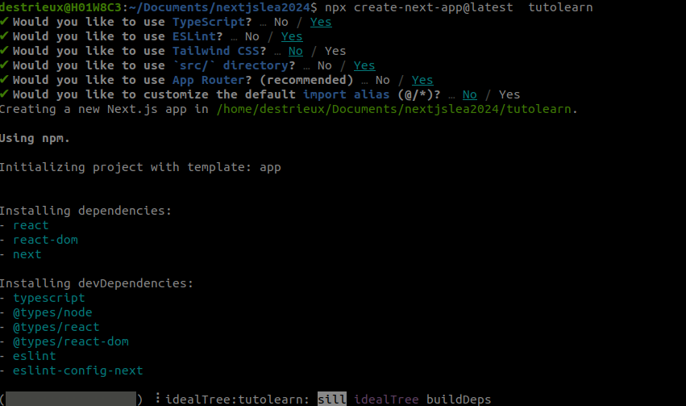

# Nextjs learning 2024


# nextjslea2024

[doc next js ](https://nextjs.org/learn?utm_source=next-site&utm_medium=navbar)

# create projet

```css
npx create-next-app@latest  tutolearn
```


# use client 

